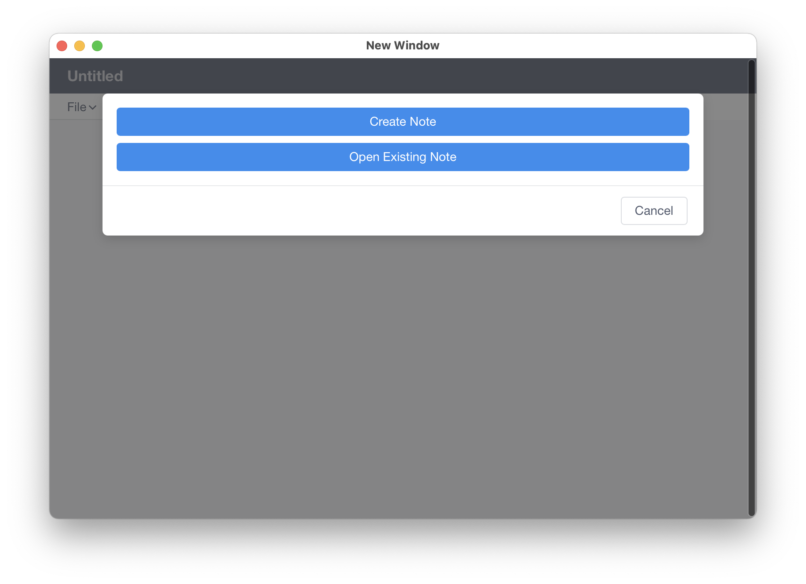
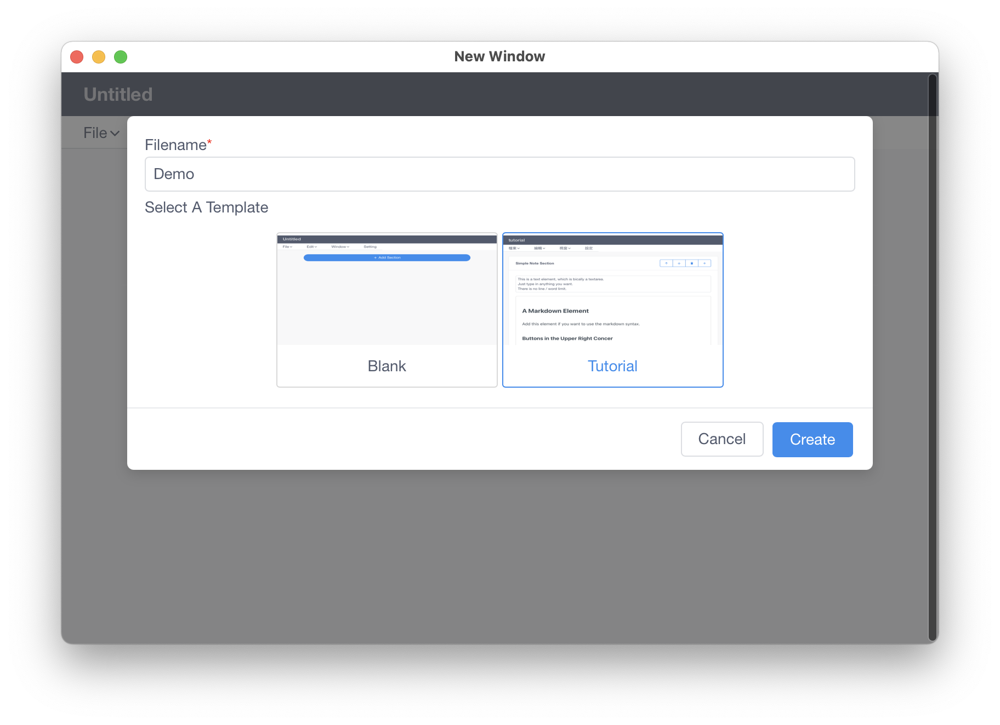
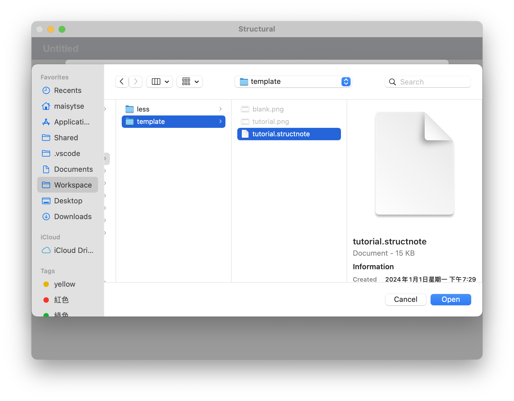
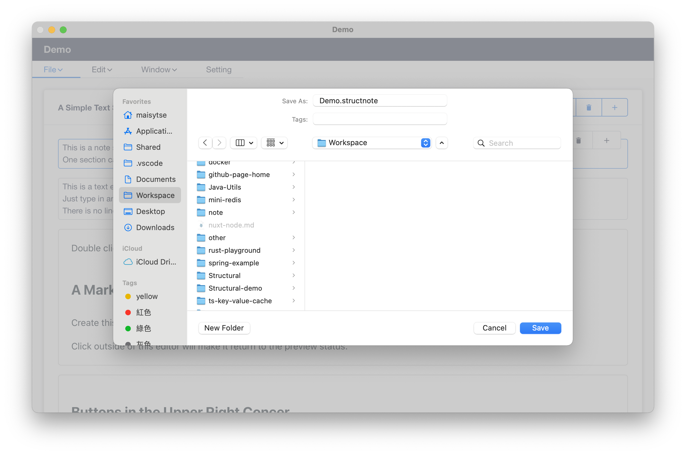
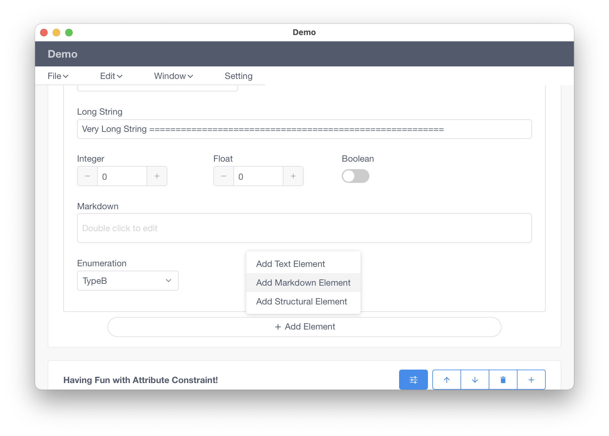
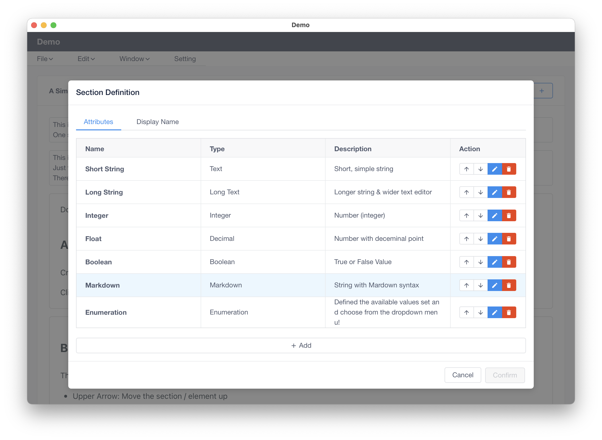
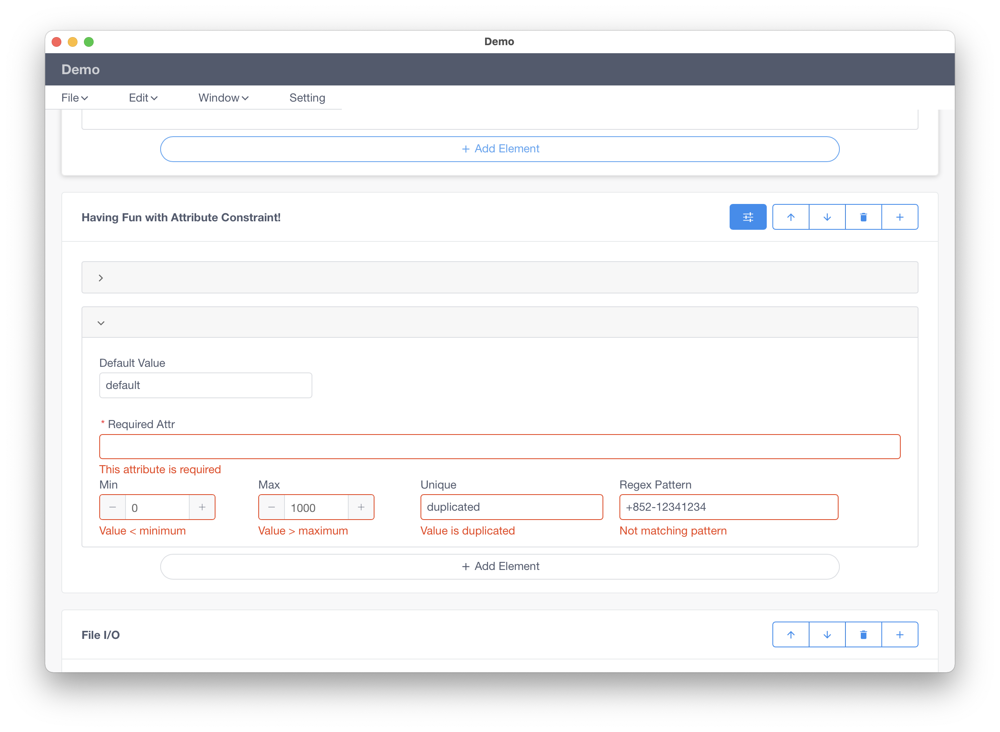
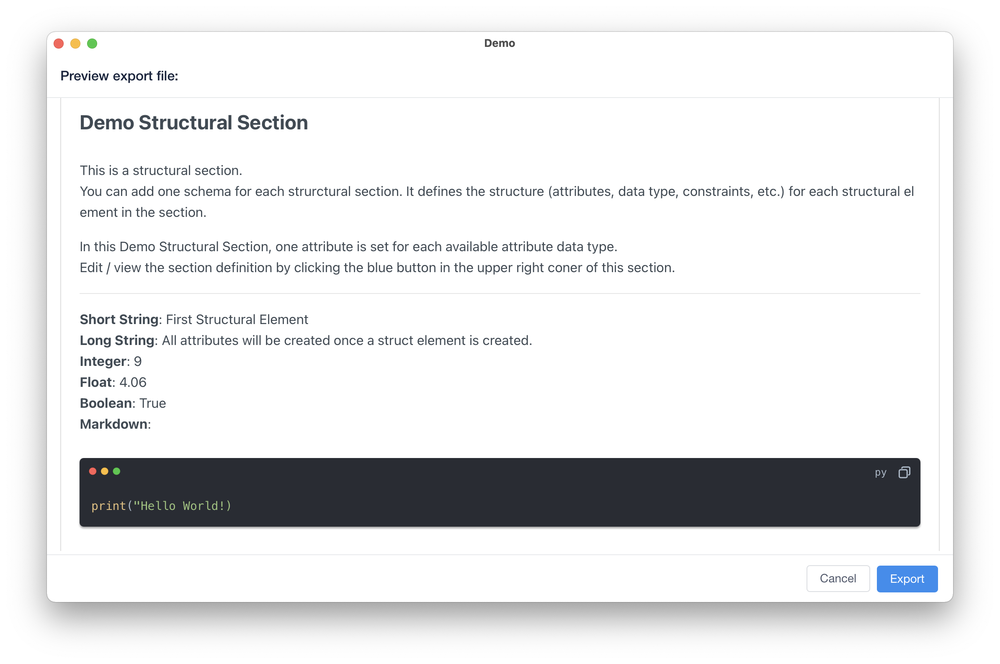
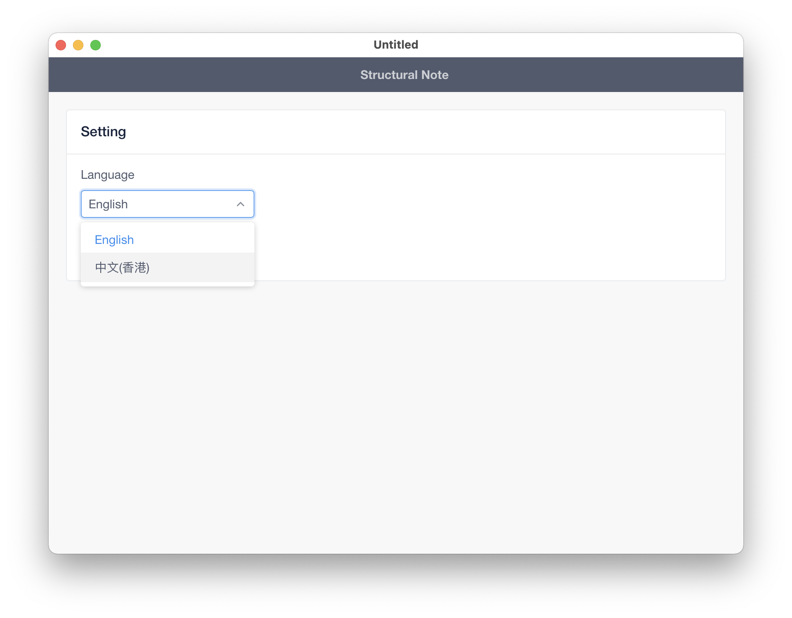
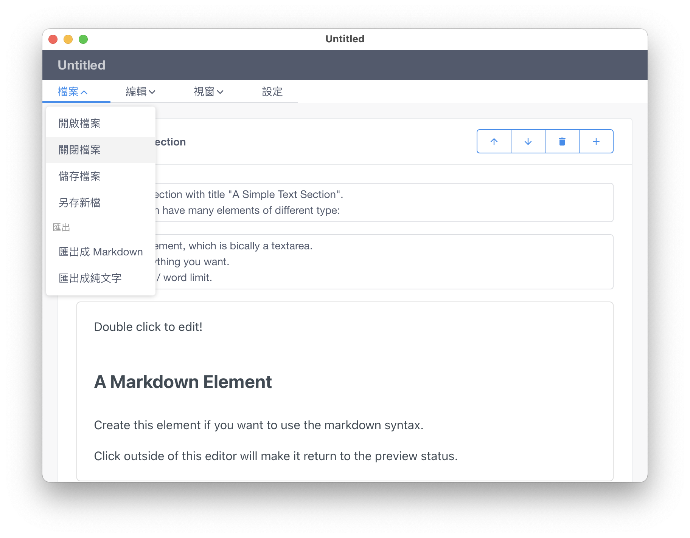

# Structural Note

A desktop app for creating note with structural data. It is like having a small database inside a text file which you can define schema structure and edit corresping records. In between the structural records, you can insert note in plain text or markdown format. 

## Demo
[Online Demo](https://tcm9439.github.io/structural-note-demo/test/template/) for note editing functions.

**Note**
- Don't go the root `index.html` or `setting/index.html` of the demo page directly, they will not work in the demo (or will work but not by it own). Use the link above as the entry point and only navigate around by the UI. 
- The file-related functions (save, load, export, etc.), window-related functions and shortcut will not work in this web-based demo.

## Features & Screenshot
### Files
The app create and store the note in a custom format `.structnote`. You can share the file to the others and let them open it with Structural Note app.

Creating a new note:

Open a note in the file system:

Saving the note:

### Editing
Adding Note Elements:

Editing Section Definition (Record Schema)

### Value Validation
You can set up rules to enable validation:

### Export to Various Format
Exporting the note to Markdown format with preview:

### Setting

Multi-language support (English & Chinese):

